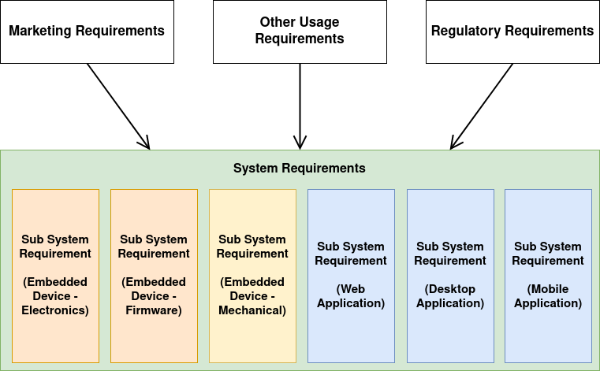

# Start of any product

1. Identify a user requirement
1. Plan for some solution to fullfill the requirement
1. Develop a proof of concept (This is not the final product)
1. Plan the high level product capabilities (Think of regulatory requirements as well)
1. Plan the product requirements as a system
1. Break this system down to sub-systems
1. Plan requirements of each sub-system
1. Group related requirements into independent features
1. Plan how to achieve each of these requirements
    - Electrical/Electronics
    - Firmware
    - External software (Web, Mobile or Application)
    - Mechanical

## Developing a proof of concept

- POC is not the final product
- This is a prototype using easily accessible tools (Arduino, RaspberryPy, etc)
- POC is to verify the feasibility of our idea
- No need to think too much about quality

## Specifications

- It's easy to overlook Specifications when designing a product
- Specifications form a single source of truth to product behaviour
- Specifications answers the question 'Why?'
- In certain product types, this can be a regulatory requirement

## Specifications for a Temperature Logger

- Looking at a [random temperature logger](https://www.logtag.com.au/product/logtag-usb-utrix-16/) in the market
- These are marketing and regulatory requirements, which forms the base of a systems requirement
- Architects of different product disciplines break this down into separate requirement
- These sub system specifications can be implemented and verified easily
